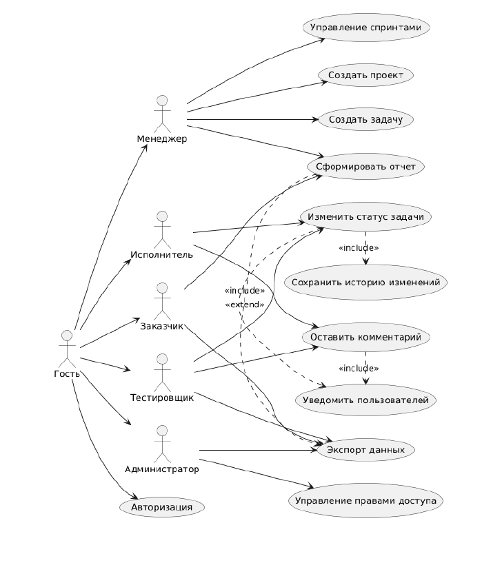

# Информационная система управления проектами и задачами (PI)

Система предназначена для автоматизации процессов планирования, организации и контроля выполнения задач в рамках командных проектов.

## Технологический стек (примерный)
*   **Backend:** JS
*   **Frontend:** React
*   **Database:** PostgreSQL
*   **Infrastructure:** Docker

## Архитектура системы
Для понимания логики работы системы ниже представлена диаграмма вариантов использования (Use Case):



*Все остальные диаграммы (последовательности, состояний, классов) находятся в папке `/docs/architecture/`.*


## 📂 Навигация по репозиторию
*   [Канбан-доска (Задачи)](https://github.com/users/yakexerr/projects/2)
*   [База знаний (Wiki)](https://github.com/yakexerr/PI/wiki)
*   [Правила разработки (CONTRIBUTING.md)](CONTRIBUTING.md)

## ⚙️ Системные требования (Requirements)

Для запуска проекта и автотестов локально необходимо установить:
* **Node.js** (версия 18.0 и выше) + npm
* **Java Development Kit (JDK)** (версия 17 и выше) — *для запуска автотестов*

## 🚀 Как запустить проект

**1. Клонирование и настройка бэкенда:**
\`\`\`bash
# Клонируем репозиторий
git clone https://github.com/yakexerr/PI

cd PI

# Устанавливаем зависимости Node.js
```
npm install
```

**2. Запуск сервера:**
```bash
node server.js
```
После этого система будет доступна в браузере по адресу: `http://localhost:3000`


# Запуск API-тестов (JavaScript / Vitest)
npm test

# Запуск UI-автотестов (Java / Selenide)
```
cd tests/functional/autotests
./gradlew test
```